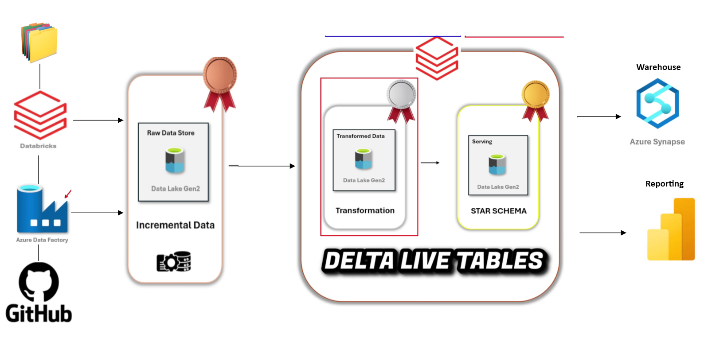

# Netflix_data_engineering_project_with_Azure

## Project Overview
This Project demonstrates an end-to-end data pipeline that processes Netflix data using a Medallion Architecture on Azure Data Lake Storage (ADLS). This project highlights the integration of Azure and Databricks for seamless data engineering, employing tools like Azure Data Factory (ADF), Databricks, Delta Live Tables, and Databricks Autoloader for efficient data flow.

## Architecture

1. **Data Ingestion (Bronze Layer)**
   - Source: GitHub repository containing Netflix data.  
   - Tool: **Azure Data Factory (ADF)** pipelines pull data from GitHub and load it into the **Bronze layer** on **ADLS**.
   - **Linked services** connect **GitHub → ADF** and **ADF → ADLS Bronze**.  
   - **Databricks Autoloader** is used to incrementally load new files into the **Bronze Layer**, reducing manual ingestion efforts.

2. **Data Processing & Transformation (Silver Layer)**
   - **Databricks Access Connector** links ADLS to Databricks.  
   - **Azure Databricks** processes raw data and applies cleaning & transformations.  
   - Data is stored as **Delta Tables** in the **Silver Layer**.  

3. **Data Aggregation & Analysis (Gold Layer)**
   - Transformed data is further aggregated in **Delta Live Tables**.  
   - **Unity Catalog** is used for data governance & organization.  
   - **Databricks Workflows** schedule and orchestrate jobs.  

## Technologies Used
Azure Data Lake Storage (ADLS) – Storage for Bronze, Silver, and Gold layers.
Azure Data Factory (ADF) – ETL tool for ingesting data from GitHub to ADLS.
Azure Databricks – Processing, transformation, and analysis engine.
Delta Lake & Delta Live Tables – Optimized storage & real-time transformations.
Databricks Autoloader – Automated and incremental ingestion of new data files.
Unity Catalog – Centralized governance for managing data assets.
Databricks Workflows – Job scheduling and orchestration.
